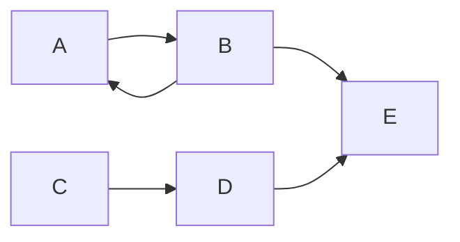

+++
title = 'Markdown'
date = 2024-10-04T13:25:31+02:00
draft = false
weight = 20
+++

## Markdown

### Titulos

Para establece los titulos usare la siguiente sintaxis

```markdown
# titulo1
## titulo2
### titul3
#### titulo4
##### titulo5
###### titulo6
``` 
y se verá así:

# titulo1
## titulo2
### titulo3
#### titulo4
##### titulo5
###### titulo6

---

### Negrita y formate

Para ver el texto en negrita escribo

```markdown
**Texto en negrita** texto normal
```

---


para poner un shortcode asi
```bash
{{\<>}}
```
---


---


caracol dormidor

